#  Deploying a Game/Website using AWS Amplify  

## Prerequisites  
Before you begin, ensure you have the following:  
- A **GitHub repository** containing your game or website.  
- An **AWS account** with access to AWS Amplify.  
- Basic understanding of GitHub repositories.  

## Deployment Steps  

### 1️⃣ Search for AWS Amplify  
- Log in to the **AWS Console**.  
- Search for **"Amplify"** in the AWS search bar.  
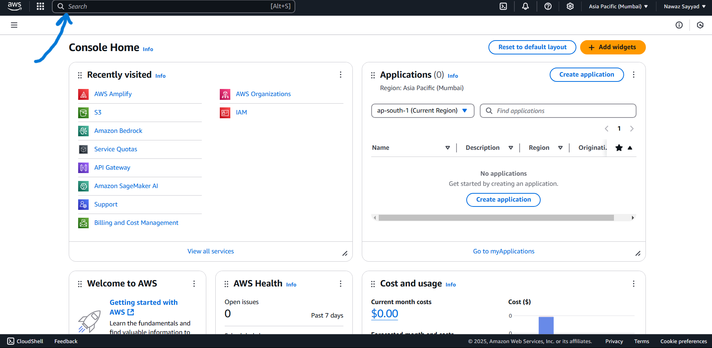  

### 2️⃣ Open Amplify"  
- Select **Amplify** from the results.  
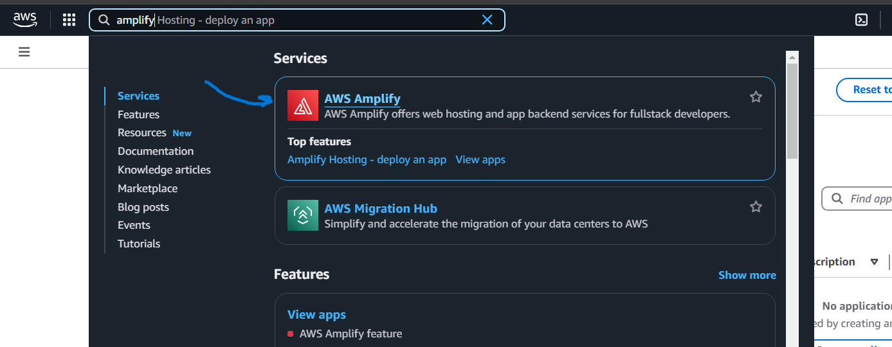  

### 3️⃣ Connect GitHub Repository  
- Click on **"Deploy App"** and select **GitHub** as the repository source.  
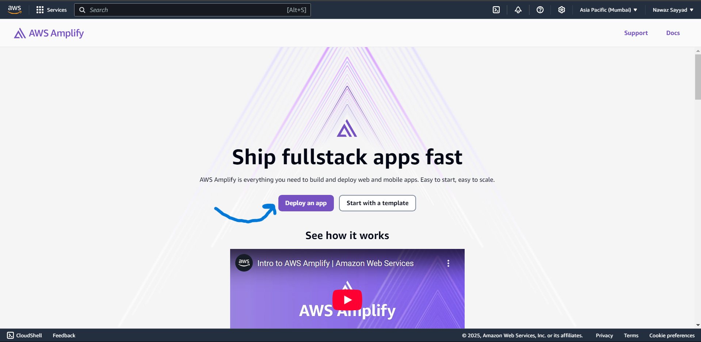  
- Authorize AWS Amplify to access your GitHub account.  
- Select your **GitHub repository**.  
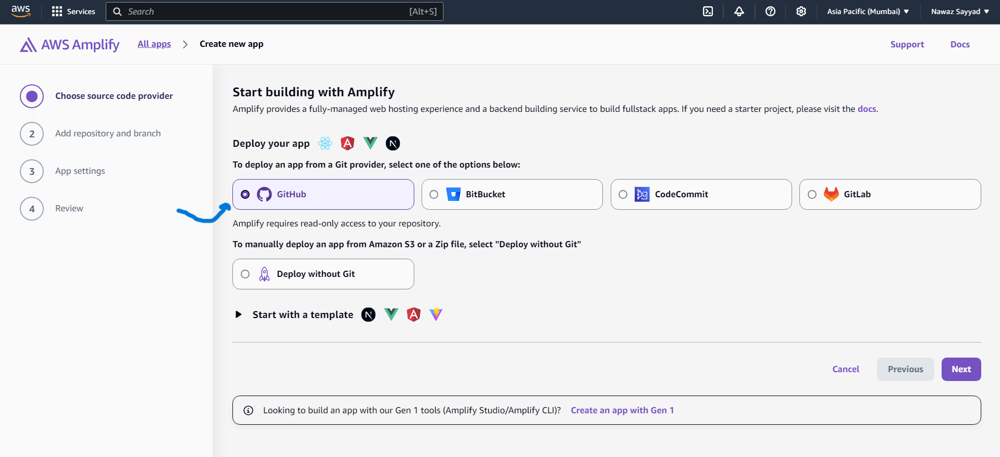  

### 4️⃣ Choose the Repository and Branch  
- Select the specific repository containing your **game or website**.  
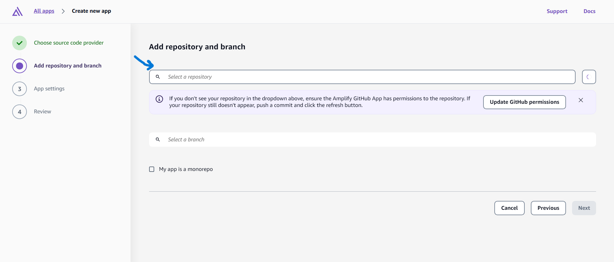  
- Choose the correct **branch** (e.g., `main` or `master`).  
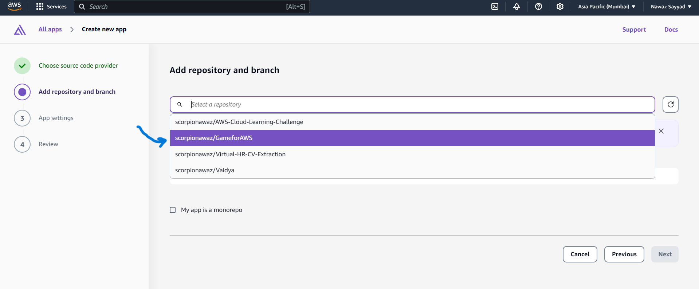  

### 5️⃣ Configure Deployment  
- Click **Next** until you reach the **Save and Deploy** step.  
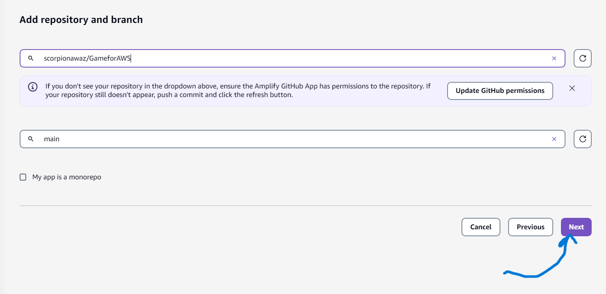  
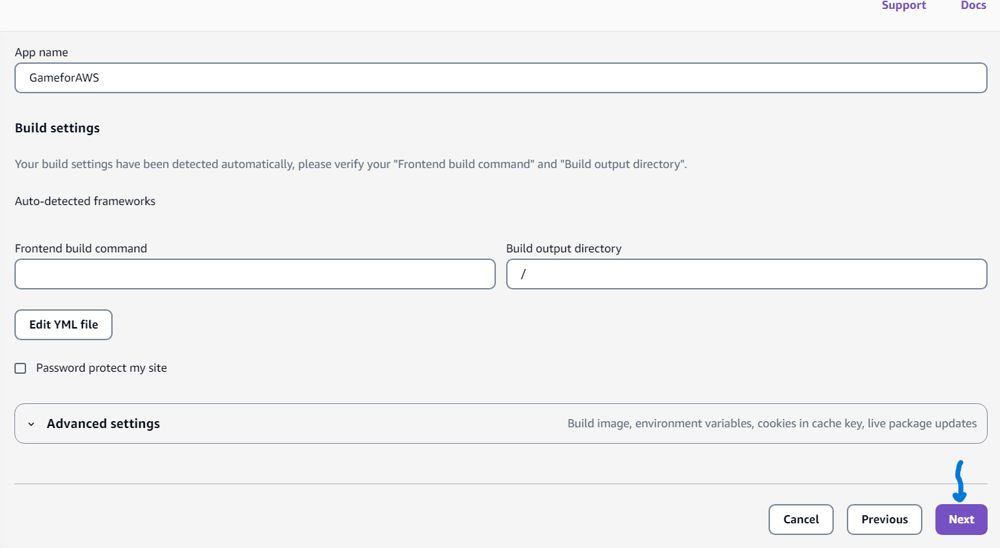  
- Click **Save and Deploy**.  
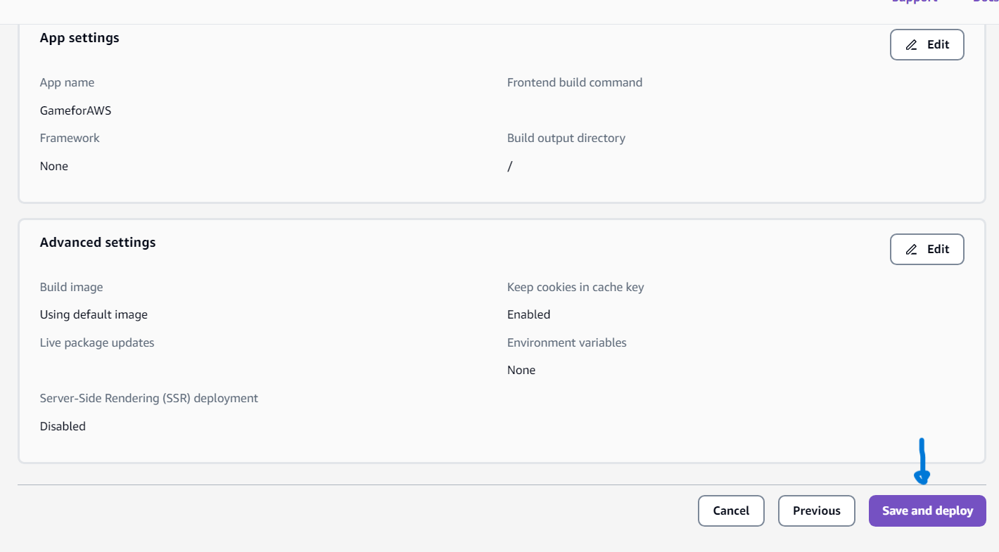  

### 6️⃣ Deployment in Progress  
- Amplify will now start deploying your game/website.  
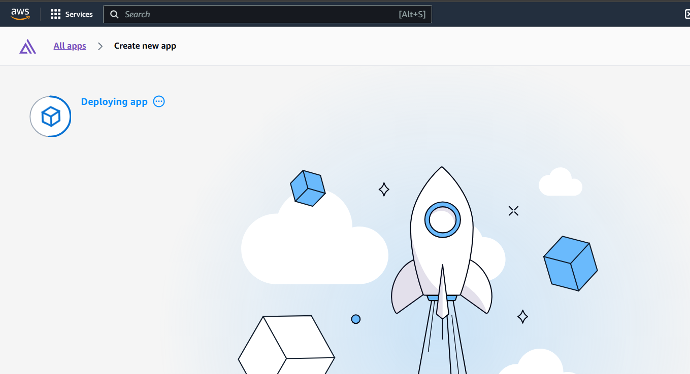  
  

### 7️⃣ Deployment Complete  
- Once deployed, click on the **generated URL** to view your application.  
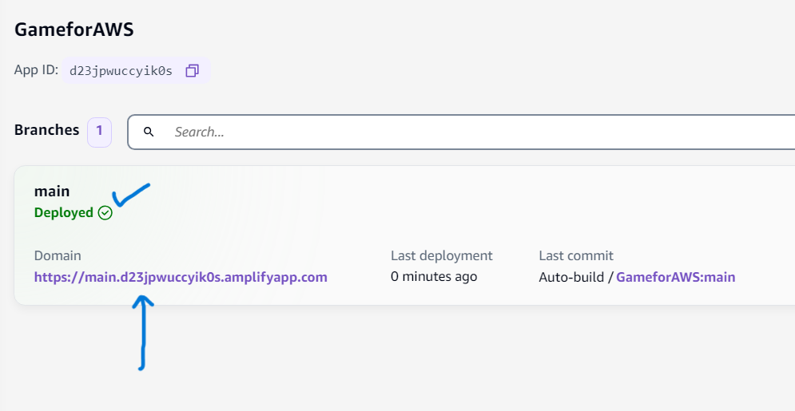  
- Your **game/website** is now live! 🎉  
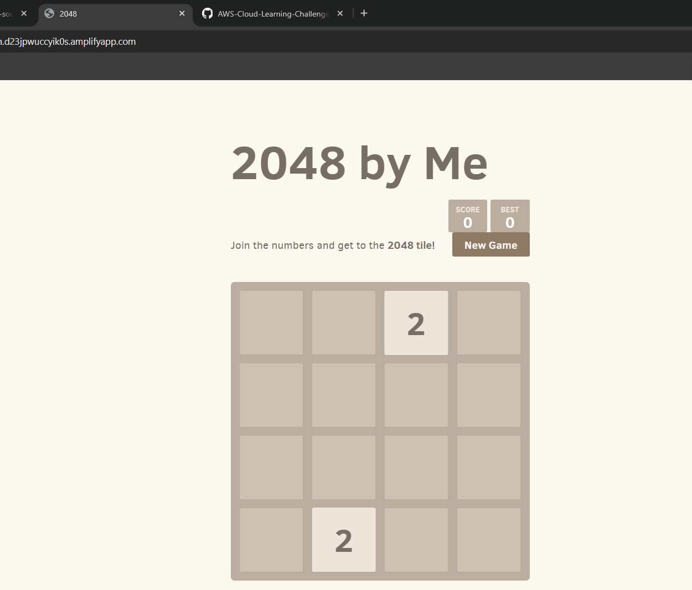  

## 🎯 Conclusion  
By following these simple steps, you can deploy your GitHub-hosted game or website using **AWS Amplify** with just a few clicks. Enjoy your deployed application! 🚀  

